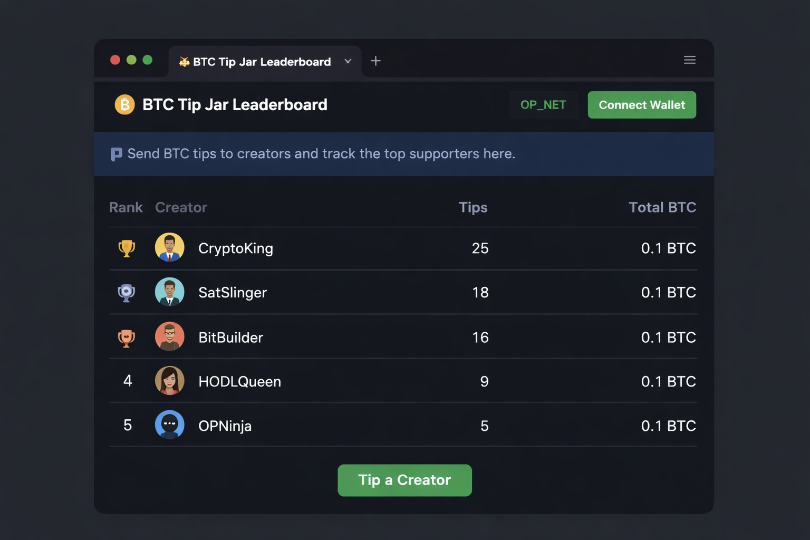

# BTC Tip Jar Leaderboard
Built with Vibecode + Bob AI for the OP_NET Builder Competition.

A social Bitcoin tipping application where users can support creators and compete on a transparent BTC leaderboard.

---

## 🚀 Overview

BTC Tip Jar Leaderboard is a lightweight social tipping application built for Bitcoin Layer 1. It enables users to send small BTC tips to creators and track engagement through a transparent public leaderboard.

The project focuses on driving real Bitcoin utility through simple, social micro-transactions.

---

## ❗ Problem

Most Bitcoin applications focus on trading or complex DeFi. There is limited infrastructure that encourages everyday social usage of BTC.

Creators often rely on centralized platforms for monetization.

---

## ✅ Solution

BTC Tip Jar Leaderboard introduces:

- ⚡ One-click BTC tipping  
- 🏆 Public leaderboard rankings  
- 👤 Creator tip tracking  
- 🔍 Transparent on-chain activity  

This encourages community engagement while showcasing real Bitcoin usage.

---

## 🧩 Core Features (MVP)

- Send BTC tips to users  
- View global tip leaderboard  
- Creator profile pages  
- Transaction history display  
- Simple wallet connection  

---

## 📸 Demo Screenshot

Example UI preview of the leaderboard interface.

---

## ⚙️ How It Works

1. User connects their Bitcoin wallet  
2. Select a creator profile  
3. Send a small BTC tip  
4. Transaction is recorded on-chain  
5. Leaderboard updates based on total tips received  

---

## 🏗 Tech Stack (Planned)

Frontend  
- React  

Backend  
- Node.js  

Blockchain  
- Bitcoin Layer 1  

AI Development  
- Vibecode + Bob AI  

---

## 🔮 Future Roadmap

- Weekly top-tipper rewards  
- NFT achievement badges  
- Social feed integration  
- Mobile optimization  

---

## 👨‍💻 Development Status

🚧 Early-stage prototype being built for Vibecode Challenge.

Current focus:

- MVP interface  
- Tip transaction logic  
- Leaderboard data structure  

---

## 🤝 Contributing

Contributions and suggestions are welcome.

If you'd like to improve this project:

1. Fork the repository  
2. Create a feature branch  
3. Submit a pull request  

---

## 📜 License

MIT License
